# Stock Rockets Forum

Stock Rockets is an online forum dedicated to discussions surrounding various economic topics, catering to individuals interested in news, strategies, analysis, economics, cryptocurrencies, finance, and education related to the financial world.

This repository hosts the codebase for Stock Rockets, providing users with a platform to engage in insightful conversations, share knowledge, and stay updated on the latest trends and developments in the realm of economics and finance.

Visit the deployed site: [Stock Rockets Forum](link goes here)

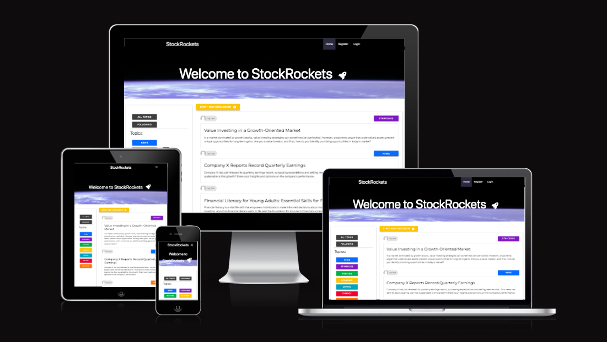

## Site Owner Goals for Stock Rockets Forum

**1. Facilitate Engaging Discussions:**
Foster an environment where users can engage in meaningful discussions, exchange ideas, and broaden their understanding of economic concepts across various topics.

**2. Provide Accessible Information:**
Ensure users have easy access to reliable information, news updates, and analytical insights on economic trends, strategies, and financial markets.

**3. Seamless User Experience:**
Design a user-friendly interface that prioritizes intuitive navigation, smooth functionality, and responsiveness across different devices, enhancing the overall user experience.

**4. Foster Community Interaction:**
Encourage community interaction by enabling users to connect with like-minded individuals, follow discussion threads, and actively participate in building a vibrant community centered around economic discourse.

**5. Empower Learning and Growth:**
Empower users to expand their knowledge, refine their strategies, and stay informed about the dynamic landscape of economics and finance through educational resources, expert insights, and peer-to-peer learning opportunities.

## User Experience (UX)

### User Stories

#### First-time User

- As a first-time user, I want to explore the diverse range of economic topics discussed on Stock Rockets and understand how the forum can enrich my understanding of finance and economics.
- As a first-time user, I expect the forum to be easy to navigate, allowing me to quickly find relevant discussions and participate without facing any hurdles.
- As a first-time user, I prefer to browse the forum without the need for immediate registration, enabling me to gauge the quality of discussions and content before committing to sign up.

#### Returning User

- As a returning user, I aim to stay updated on the latest discussions and news in my areas of interest within the economic sphere.
- As a returning user, I want to easily access previously followed threads and pick up where I left off in ongoing conversations.

#### Dedicated User

- As a dedicated user, I seek opportunities to actively contribute to discussions, share insights, and engage with fellow members to enrich the community experience.
- As a dedicated user, I'm interested in receiving notifications or updates about new discussion threads, replies to my comments, and other relevant activities within the forum.

## Design

### Colour Scheme

In designing the color scheme for Stock Rockets, the following colors were carefully selected to ensure a cohesive and visually appealing interface:

- **Start New Discussion Button (#FFC500):** This vibrant yellow color provides a distinct highlight for the "Start New Discussion" button, drawing attention to this important action.

- **User Displaying Author for Thread (Shades of Gray):** Different shades of gray (#B7B7B7, #C6C6C6) are utilized to display the author of a thread, ensuring clear visibility while maintaining a subtle and consistent aesthetic.

- **All Topics and Following Buttons (Shade of Gray):** The buttons for all topics and following threads adopt a consistent shade of gray (rgb(62, 62, 62)), providing uniformity throughout the forum interface.

- **Navigation and Footer (Black Text on White Background):** The navigation and footer sections feature black text on a white background, ensuring readability and contrast.

- **Active Style for Navigation (Space Cadet):** Active navigation items are styled with a shade of blue (rgba(151, 159, 230, 0.274)), reminiscent of the space theme of Stock Rockets.

- **Materialize Green Color for Buttons:** Buttons such as "Sign In," "Register," "Delete," and "Edit Comment" adopt the Materialize green color, maintaining consistency with the framework and enhancing user familiarity.

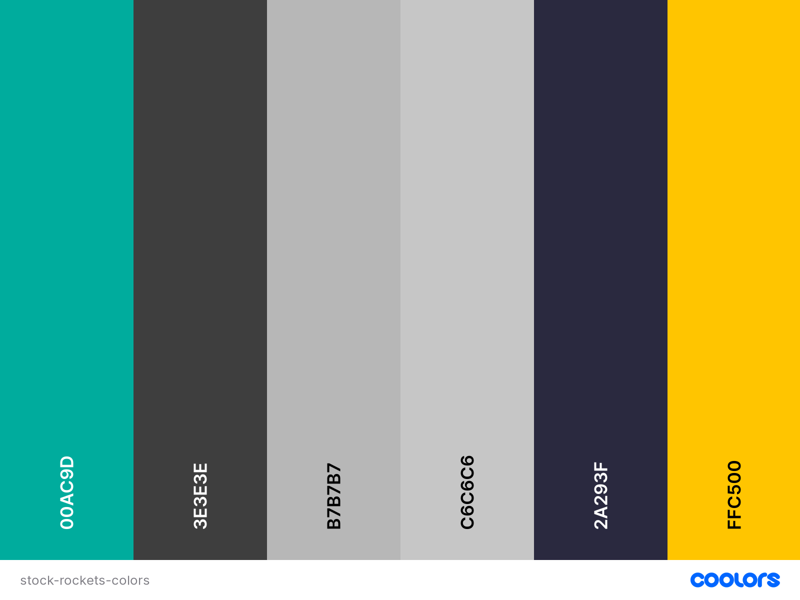
This color scheme was created by [Coolors](https://coolors.co/).

### Typography

*Google Fonts was used to import the fonts.*

The following fonts were chosen to complement the design aesthetic and ensure readability across the forum interface:

- **Headings (Font: Montserrat, sans-serif):** Montserrat font is used for headings, providing a modern and elegant appearance that aligns with the forum's style.

- **Main Text (Font: Open Sans, sans-serif):** Open Sans font is utilized for main text, offering clarity and readability for prolonged reading sessions.

## Wireframes

Wireframes were produced using Balsamiq. These wireframes were created prior to the project, serving as a conceptual representation of the forum's layout and features. Please note that they may not precisely reflect the final project, as some elements and features are subject to change or implementation. Additionally, the wireframes include placeholders for future features intended to be implemented in subsequent iterations of the project.

 

 
Wireframe

 

## Data Model

In this project, principles of Object-Oriented Programming were applied along with Django's Class-Based Generic Views. Django AllAuth facilitated the user authentication system.

### Thread Model

The Thread model enables users to initiate discussion threads. It includes the following fields:

- **thread_id:** Auto-incremented primary key for each thread.
- **author:** Foreign key to the User model, indicating the author of the thread.
- **title:** CharField for the title of the thread.
- **slug:** SlugField for creating SEO-friendly URLs.
- **topic:** IntegerField representing the topic category of the thread.
- **thread_text:** TextField containing the content of the thread.
- **created_on:** DateTimeField recording the date and time of thread creation.
- **updated_on:** DateTimeField recording the last update time of the thread.
- **follow:** Many-to-many relationship field with User model, allowing users to follow threads.

### Comment Model

The Comment model facilitates users to comment on individual threads. It consists of the following fields:

- **comment_id:** Auto-incremented primary key for each comment.
- **thread:** Foreign key to the Thread model, linking the comment to a specific thread.
- **author:** Foreign key to the User model, indicating the author of the comment.
- **body:** TextField containing the content of the comment.
- **created_on:** DateTimeField recording the date and time of comment creation.
- **updated_on:** DateTimeField recording the last update time of the comment.

The schema diagram below illustrates the database structure.

## Testing

Testing and results can be found [here in the TESTING.md file](/TESTING.md)

## Features

### Header

The homepage features a header showcasing imagery of the earth and outer space, symbolizing the essence of Stock Rockets and conveying the notion of *the sky is the limit*.

### Navigation Bar

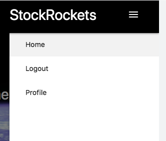

The navigation bar is transformed into a hamburger icon, which reveals a side slide-out menu on smaller screens. An active class is dynamically assigned to the page the user is currently on, displaying a blue/violet color on larger screens and a gray color on the mobile menu.

The navigation bar adapts based on whether the user is signed in or not.

#### When Not Signed In:

#### When Signed In:

<h3 style="text-decoration: underline;">Home Page</h3>

### Thread Display

The main content area of the home page features a list of discussion threads, providing users with easy access to ongoing conversations. Each discussion thread is presented in a card panel format, containing the following information:

- **Author's Name:** The name of the user who authored the thread.
- **Topic:** The topic under which the thread is categorized.
- **Thread Title:** The title of the discussion thread.
- **Thread Text:** A brief excerpt or summary of the thread content.

Users can interact with the discussion threads by clicking on the thread title, which redirects them to the full thread details page, where they can view the complete discussion and participate in the conversation.

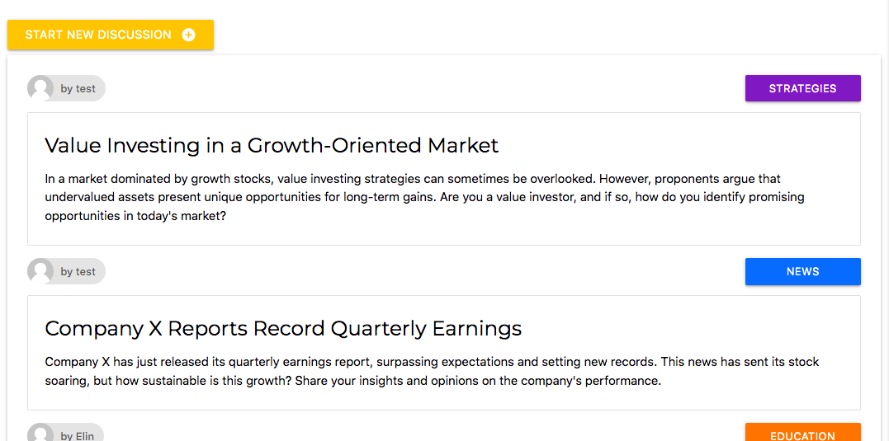

### Topic Buttons

The topic buttons on the page serve a dual purpose:

1. **Visual Categorization:** Each discussion thread is associated with a specific topic, visually indicated by the topic buttons. These buttons provide an appealing way of displaying which topic a thread is categorized under, allowing users to quickly identify the subject matter of each discussion.

2. **Filtering Threads:** When a user clicks on a specific topic button, the page dynamically filters and displays only those discussion threads that are categorized under the selected topic. This functionality enables users to focus on discussions related to their areas of interest.

Additionally, a special "All Topics" button is provided, allowing users to reset the topic filter and display all discussion threads regardless of their categorization. This ensures that users have the option to browse discussions across all topics whenever desired.

*Here are the topic buttons displayed*:

*A demonstration of threads filtered by the topic "analysis"*:
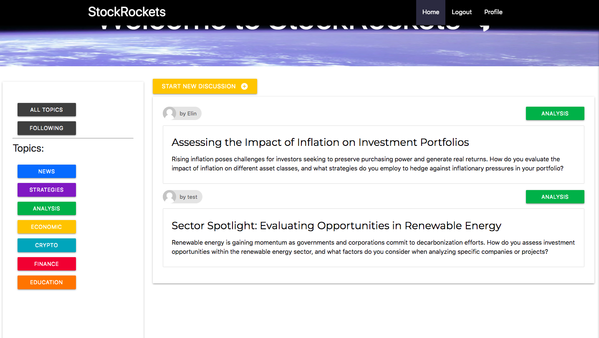

The buttons also feature hover effects, enhancing user experience by providing visual feedback when users interact with them.

### Modal for Creating New Threads

A modal window is utilized for creating new discussion threads. This modal offers a user-friendly interface for users to input details such as the thread title, text, and select the topic category. The modal appear when the "Start new discussion"-button is clicked.

*Start New Discussion Button:*

*Start New Discussion Button when hovered:*

*When the button is clicked this modal opens:*

*The user gets to choose a topic:*
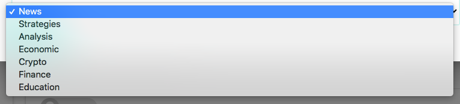

If the thread title already exists in a previous post, the user receives a notification stating that there is an issue with the post and is prompted to try again. Upon reopening the modal, an error message informs the user that a thread with the same title already exists. This will also show if there are some other error with thw post.

*Error notification for thread title and other post-related issues:*
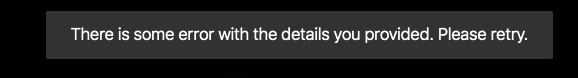

*Specific error notification for thread title:*
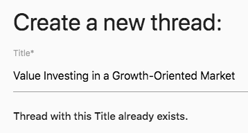

<h3 style="text-decoration: underline;">Thread Detail Page</h3>

### Masthead
The masthead section contains information about the thread author and the thread's creation date. It displays the author's profile picture, username, and the date when the thread was created. Additionally, it includes a button for users to follow the thread if they are logged in. When a user follows a thread a toast gives userfeedback and stating that the user has followed a thread. If the user clicks twice on the button it will unfollow the thread the second click. 

If the user is not authenticated, it prompts them to log in to follow the thread.

*Follow thread:*

*Log in to follow thread:*
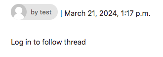

### Thread Content
The main content area displays the title and text of the thread. It provides users with the core information of the thread and allows them to read the content. The thread title is displayed prominently, followed by the thread text.

### Comments Section
The comments section displays comments made by users on the thread. Each comment includes the author's name, profile picture, and the date when the comment was created. Users can view comments and interact with them, such as deleting or editing their own comments if they are the author. There's a form for authenticated users to leave a new comment. When a user creates a new comment or edit an existing one they get a toast that confirms their actions taken.

If the user is not authenticated, it prompts them to log in to leave a comment.

*The comment section:*

*Displaying comment count and user feedback to indicate the username the user will post the comment as:*

*If user is not authenticated:*
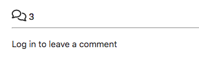

### Delete Confirmation Modal
The delete confirmation modal provides a confirmation dialog for users before they delete their comments. It asks users to confirm their action before permanently deleting their comment. Users can either confirm or cancel the deletion action using the provided buttons.
If the user chooses to delete a toast will apear with a confirmation message stating that the comment is deleted.

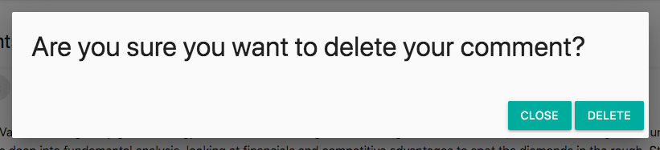

<h3 style="text-decoration: underline;">Profile Page</h3>

### Display Followed Threads

At the profile page, users can view a list of all the threads they are following, presented in a format similar to the feed on the homepage.

### Unfollow Threads

If a user wishes to unfollow a thread, they can simply click the 'Unfollow Thread' button, and the thread will be removed from their list. Additionally, they will receive a toast message confirming that they have successfully unfollowed the thread.

<h3 style="text-decoration: underline;">Sign in/Sign out/Sign up</h3>

Django allauth was installed and used to create the Sign up, Log in and Log out functionality.
Success messages inform the user if they have logged in/ logged out successfully.

The HTML for theese pages where taken and modified for this project from - [Code Institute - I Think Therefore I Blog](https://github.com/Code-Institute-Solutions/blog)

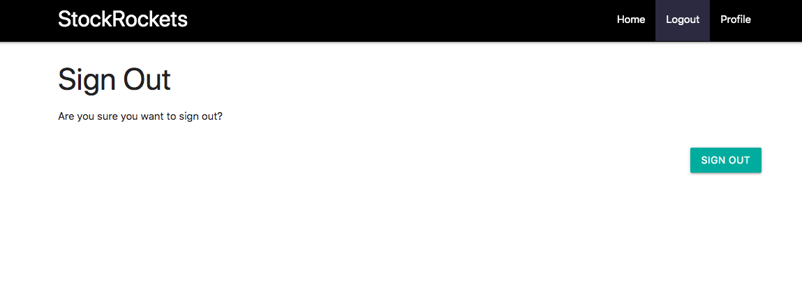

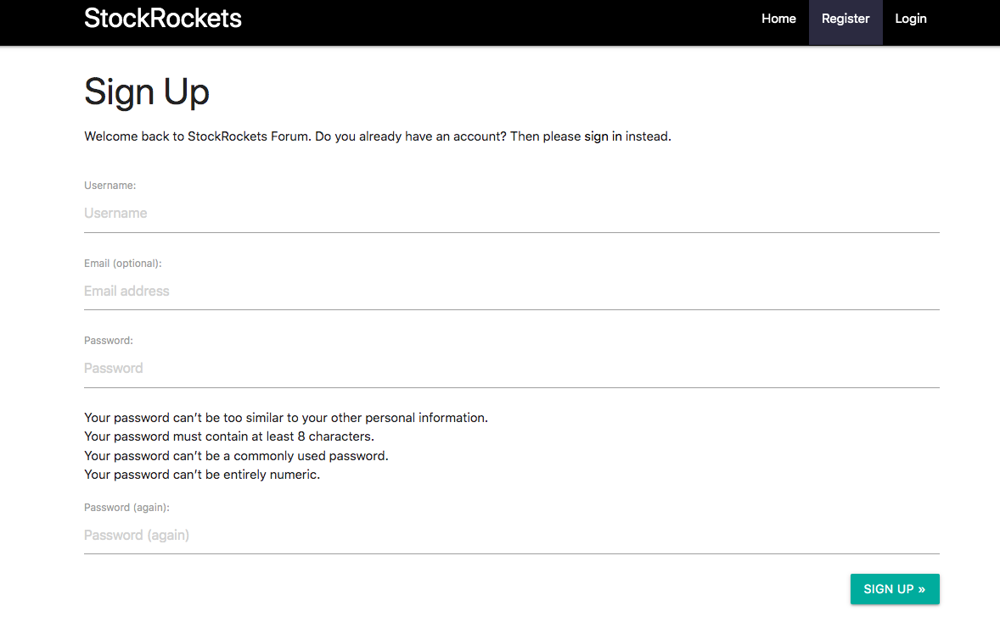

## Future Features

### Upvote/Downvote Comments
Users will be able to upvote or downvote comments in discussion threads, allowing them to express agreement or disagreement with specific comments.

#### Acceptance Criteria:
- AC1: Users can see upvote/downvote buttons next to each comment.
- AC2: Users can click on the upvote/downvote buttons to express their preference.
- AC3: The total vote count for each comment is updated in real-time.

### Reports of Inappropriate Comments or Threads
Moderators will have the ability to delete inappropriate comments or threads, helping to maintain a respectful and constructive environment within the community.

#### Acceptance Criteria:
- AC1: Moderators can access moderation tools from the admin dashboard.
- AC2: Moderators can view reported comments or threads.
- AC3: Moderators can delete reported comments or threads that violate community guidelines.
- AC4: Registered users can report a comment for review by moderators.

### Receive and Manage Notifications

As a registered user, you can receive notifications for new comments or replies on threads you're participating in to stay updated on conversations.

#### Acceptance Criteria:

- **AC1:** User can opt-in to receive notifications for specific threads.
- **AC2:** User receives a notification when a new comment is posted on a thread they're participating in.
- **AC3:** User can manage notification settings in their account settings.

### User Profile

As a registered user, you can view your profile information to track your activity and manage your followed threads effectively.

#### Acceptance Criteria:

- **AC1:** Users can navigate to their profile page from any page on the forum.
- **AC2:** The profile page displays the threads that the user is following.
- **AC3:** The profile page shows the user's activity, including liked threads, comments, etc.
- **AC4:** Users can add a profile picture and a bio on their profile page.

## Deployment - Heroku

To deploy this page to Heroku from its GitHub repository, the following steps were taken:

### Create the Heroku App:
- Log in to [Heroku](https://dashboard.heroku.com/apps) or create an account.
- On the main page click the button labelled New in the top right corner and from the drop-down menu select "Create New App".
- Enter a unique and meaningful app name.
- Next select your region.
- Click on the Create App button.

### Attach the Postgres database:
- In the Resources tab, under add-ons, type in Postgres and select the Heroku Postgres option.
- Copy the DATABASE_URL located in Config Vars in the Settings Tab.

### Prepare the environment and settings.py file:
- In your GitPod workspace, create an env.py file in the main directory.
- Add the DATABASE_URL value and your chosen SECRET_KEY value to the env.py file. 
- Update the settings.py file to import the env.py file and add the SECRETKEY and DATABASE_URL file paths.
- Comment out the default database configuration.
- Save files and make migrations.
- Add Cloudinary URL to env.py
- Add the cloudinary libraries to the list of installed apps.
- Add the STATIC files settings - the url, storage path, directory path, root path, media url and default file storage path.
- Link the file to the templates directory in Heroku.
- Change the templates directory to TEMPLATES_DIR
- Add Heroku to the ALLOWED_HOSTS list the format ['app_name.heroku.com', 'localhost']

### Create files / directories
- Create requirements.txt file
- Create three directories in the main directory; media, storage and templates.
- Create a file named "Procfile" in the main directory and add the following: web: gunicorn project-name.wsgi

### Update Heroku Config Vars
Add the following Config Vars in Heroku:
- SECRET_KEY value 
- CLOUDINARY_URL

### Deploy
- NB: Ensure in Django settings, DEBUG is False
- Go to the deploy tab on Heroku and connect to GitHub, then to the required repository. 
- Scroll to the bottom of the deploy page and either click Enable Automatic Deploys for automatic deploys or Deploy Branch to deploy manually. Manually deployed branches will need re-deploying each time the repo is updated.
- Click View to view the deployed site.

The site is now live and operational.
## Forking this repository
- Locate the repository at this link [StockRockets](link to stockrockets).
- At the top of the repository, on the right side of the page, select "Fork" from the buttons available. 
- A copy of the repository is now created.

## Cloning this repository
To clone this repository follow the below steps: 

1. Locate the repository at this link [StockRockets](Link to respitory at github). 
2. Under **'Code'**, see the different cloning options, HTTPS, SSH, and GitHub CLI. Click the prefered cloning option, and then copy the link provided. 
3. Open **Terminal**.
4. In Terminal, change the current working directory to the desired location of the cloned directory.
5. Type **'git clone'**, and then paste the URL copied from GitHub earlier. 
6. Type **'Enter'** to create the local clone. 

## Languages

- Python
- HTML
- CSS
- Javascript

## Frameworks - Libraries - Programs Used
- [Django](https://www.djangoproject.com/): Main python framework used in the development of this project
- [Django-allauth](https://django-allauth.readthedocs.io/en/latest/installation.html): authentication library used to create the user accounts
- [PostgreSQL](https://www.postgresql.org/) was used as the database for this project.
- [Heroku](https://dashboard.heroku.com/login) - was used as the cloud based platform to deploy the site on.
- [Responsinator](http://www.responsinator.com/) - Used to verify responsiveness of website on different devices.
- [Balsamiq](https://balsamiq.com/) - Used to generate Wireframe images.
- [Chrome Dev Tools](https://developer.chrome.com/docs/devtools/) - Used for overall development and tweaking, including testing responsiveness and performance.
- [Font Awesome](https://fontawesome.com/) - Used for icons in information bar.
- [GitHub](https://github.com/) - Used for version control and agile tool.
- [Google Fonts](https://fonts.google.com/) - Used to import and alter fonts on the page.
- [W3C](https://www.w3.org/) - Used for HTML & CSS Validation.
- [PEP8 Online](http://pep8online.com/) - used to validate all the Python code
- [Jshint](https://jshint.com/) - used to validate javascript
- [Coolors](https://coolors.co/) - Used to create colour palette.
- [Favicon](https://favicon.io/) - Used to create the favicon.
- [Lucidchart](https://lucid.app/documents#/dashboard) - used to create the database schema design
- [Summernote](https://summernote.org/): used for Admin to add style to threads
- [Crispy Forms](https://django-crispy-forms.readthedocs.io/en/latest/) used to manage Django Forms 
- [Materialize](https://materializecss.com): CSS Framework for developing responsiveness and styling

## Credits
    
- [Stack Overflow](https://stackoverflow.com/)
- [Materialize](https://materializecss.com)
- [Pexels](https://www.pexels.com/): All imagery on the site was sourced from Pexels.com
- [Code Institute - I Think Therefore I Blog](https://github.com/Code-Institute-Solutions/blog)

## Acknowledgments

Many thanks to my mentor A Sandeep for his support and valuable insights and advice. Thanks to The Code Institute tutoring for all your patience and help.

Also, many thanks to my fellow student Anton Eriksson.