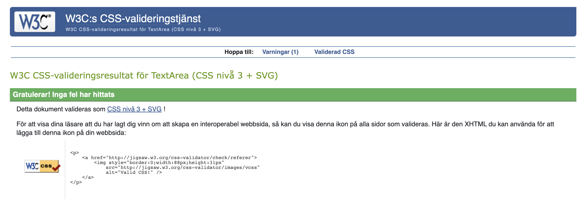
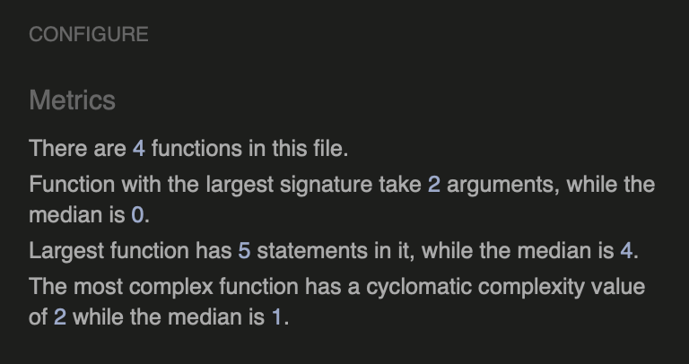
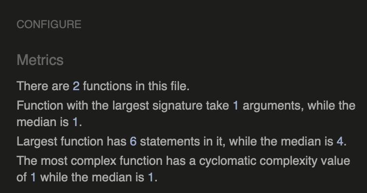

## Validator Testing

### HTML

All HTML pages were run through the [W3C HTML Validator](https://validator.w3.org/)

| Page                 | Logged Out | Logged In |
|----------------------|------------|-----------|
| base.html            | No errors  | No errors |
| index.html           | No errors  | No errors |
| thread_detail.html   | No errors  | No errors |
| profile.html         | N/A        | No errors |
| login.html           | No errors  | N/A       |
| logout.html          | N/A        | No errors |
| signup.html          | No errors  | N/A       |

### CSS
No errors were found when passing my CSS file through the official [W3C CSS Validator](https://jigsaw.w3.org/css-validator/)

 

 
CSS

 

 ### Javascript
No errors were found when passing my javascript through [Jshint](https://jshint.com/) 

Jshint

### Python
All Python files were run through [Pep8](http://pep8online.com/) with no errors found.

## Browser Testing
- The Website was tested on Google Chrome, Firefox, Safari browsers with no issues noted.
    
## Device Testing
- The website was viewed on a variety of devices such as Desktop, Laptop, iPhone 8 and iPad to ensure responsiveness on various screen sizes in both portrait and landscape mode. The website performed as intended. The responsive design was also checked using Chrome developer tools across multiple devices with structural integrity holding for the various sizes.

## Manual Testing

### Site Navigation

#### Nav Bar

| Element               | Action    | Expected Result                                                   | Pass/Fail |
|-----------------------|-----------|-------------------------------------------------------------------|-----------|
| Site Name (logo area) | Click     | Redirect to home                                                  | Pass      |
| Home Link             | Click     | Redirect to home                                                  | Pass      |
| Register Link         | Click     | Redirect to sign up page                                          | Pass      |
| Register Link         | Display   | Showing in nav bar if user is not logged in                       | Pass      |
| Login Link            | Click     | Redirect to log in page                                           | Pass      |
| Login Link            | Display   | Showing in nav bar if user is not logged in                       | Pass      |
| Profile Link          | Click     | Redirect to profile page                                          | Pass      |
| Profile Link          | Display   | Showing in nav bar if user is logged in                           | Pass      |
| Logout Link           | Click     | Redirect to log out page                                          | Pass      |
| Logout Link           | Display   | Showing in nav bar if user is logged in                           | Pass      |

#### Home Page

| Element                     | Action    | Expected Result                                                   | Pass/Fail |
|-----------------------------|-----------|-------------------------------------------------------------------|-----------|
| Thread Post Link            | Click     | Redirect thread_details page                                      | Pass      |
| Topic Button 'Following'    | Click     | If user is logged in: Redirects to Profile page                                         | Pass      |
| Topic Button 'Following'    | Click     | If user is not logged in: Redirects to log in page                                         | Pass      |

#### Thread Details Page

| Element                     | Action    | Expected Result                                                   | Pass/Fail |
|-----------------------------|-----------|-------------------------------------------------------------------|-----------|
| Login to follow thread Link | Click     | Redirect to log in page                                           | Pass      |
| Login to follow thread Link | Display   | Showing if user is not logged in                                  | Pass      |
| Login to follow thread Link | Display   | Not showing if user is logged in                                  | Pass      |
| Login to comment Link       | Click     | Redirect to log in page                                           | Pass      |
| Login to comment Link       | Display   | Showing if user is not logged in                                  | Pass      |
| Login to comment Link       | Display   | Not showing if user is logged in                                  | Pass      |

#### Footer

| Element                     | Action    | Expected Result                                                   | Pass/Fail |
|-----------------------------|-----------|-------------------------------------------------------------------|-----------|
| All links in footer         | Click     | Open in new tab and to correct location                           | Pass      |

### Home Page

| Element                     | Action    | Expected Result                                                   | Pass/Fail |
|-----------------------------|-----------|-------------------------------------------------------------------|-----------|
| Discussion threads          | Display   | Display a list of the posted threads with author, title and text  | Pass      |
| Start New Discussion Button | Click     | If user is logged in: Opens Create a new Thread Modal             | Pass      |
| Start New Discussion Button | Click     | If user is not logged in: Redirects to log in page                | Pass      |
| Create a new Thread Modal - Form Text Input (if required)   | Leave Empty | On Submit: Warning appears, form won't submit | Pass |
| Create a new Thread Modal - Form Text Input (if required)   | Blank space | On Submit: Warning appears, form won't submit | Pass |
| Topic Button 'News'         | Click     | Sorts the threadlist based on topic 'News'                        | Pass      |
| Topic Button 'News'         | Displays  | If there are no threads with topic 'News' a message is shown to the user stating that there are not yet any threads created with this topic                      | Pass      |
| Topic Button 'Strategies'   | Click     | Sorts the threadlist based on topic 'Strategies'                  | Pass      |
| Topic Button 'Strategies'         | Displays  | If there are no threads with topic 'Strategies' a message is shown to the user stating that there are not yet any threads created with this topic                      | Pass      |
| Topic Button 'Analysis'     | Click     | Sorts the threadlist based on topic 'Analysis'                    | Pass      |
| Topic Button 'Analysis'         | Displays  | If there are no threads with topic 'Analysis' a message is shown to the user stating that there are not yet any threads created with this topic                      | Pass      |
| Topic Button 'Economic'     | Click     | Sorts the threadlist based on topic 'Economic'                    | Pass      |
| Topic Button 'Economic'         | Displays  | If there are no threads with topic 'Economic' a message is shown to the user stating that there are not yet any threads created with this topic                      | Pass      |
| Topic Button 'Crypto'       | Click     | Sorts the threadlist based on topic 'Crypto'                      | Pass      |
| Topic Button 'Crypto'         | Displays  | If there are no threads with topic 'Crypto' a message is shown to the user stating that there are not yet any threads created with this topic                      | Pass      |
| Topic Button 'Finance'      | Click     | Sorts the threadlist based on topic 'Finance'                     | Pass      |
| Topic Button 'Finance'         | Displays  | If there are no threads with topic 'Finance' a message is shown to the user stating that there are not yet any threads created with this topic                      | Pass      |
| Topic Button 'Education'    | Click     | Sorts the threadlist based on topic 'Education'                   | Pass      |
| Topic Button 'Education'         | Displays  | If there are no threads with topic 'Education' a message is shown to the user stating that there are not yet any threads created with this topic                      | Pass      |
| Topic Button 'All topics'   | Click     | Dipslays all threads again                                        | Pass      |
| Topic Button 'All topics'   | Click     | If there are not yet any threads posted a message for the user is displayed                                        | Pass      |
| Topic Button 'Following'    | Click     | If user is logged in: Redirects to Profile page                                         | Pass      |
| Topic Button 'Following'    | Click     | If user is not logged in: Redirects to log in page                                         | Pass      |

### Thread Details Page

| Element                     | Action      | Expected Result                                                   | Pass/Fail |
|-----------------------------|-------------|-------------------------------------------------------------------|-----------|
| Thread Title                | Display     | Renders the thread's title in the designated area                 | Pass      |
| Thread Content              | Display     | Renders the thread's content in the designated area               | Pass      |
| Thread Information          | Display    | Renders the thread's author, date when created and thread topic in designated area | Pass |
| Follow Thread Button   | Display   | Appears in the container if the user is logged in; otherwise, does not display | Pass      |
| Follow Thread Button   | Click     | Follows the thread and adds it to the folowed threads list | Pass      |
| Follow Thread Button   | Click     | Displays a successmessage stating that the thread has been followed as userfeedback | Pass      |
| Follow Thread Button   | Click x2   | Unfollows the thread - removes it from the followed threads list | Pass      |
| Follow Thread Button   | Click x2   |  Displays a successmessage stating that the thread has been unfollowed | Pass      |
| User Comments               | Display     | Displays correct name date time and comment body                  | Pass      |
| User Comments               | Display     | Comments are ordered oldest to newest                             | Pass      |
| Update comment button       | Display     | Button only visible if user is the comment author                 | Pass      |
| Update comment button       | Click       | Opens Update Comment Form                                         | Pass      |
| Update comment form         | Leave empty | On submit: form won't submit                                      | Pass      |
| Delete comment button       | Display     | Button only visible if user is the comment author                 | Pass      |
| Delete comment button       | Click       | Opens delete comment confirmation modal                           | Pass      |
| Confirm delete button       | Click       | Comment is removed from comment section                           | Pass      |
| Confirm delete button       | Click       | Success message appears informing the user that the comment has been deleted | Pass |
| Add comment Form            | Display     | Form only visible if user is login                                | Pass      |
| Add comment Form submit button | Leave empty | On submit: form won't submit                                   | Pass      |
| Add comment Form submit button | Filled in   | Form submit - page updates and comment displays in comments section with correct content | Pass |
| Add comment Form submit button | Click | Success message appears informing the user that the comment has been added | Pass |

### Profile Page

| Element                     | Action      | Expected Result                                                   | Pass/Fail |
|-----------------------------|-------------|-------------------------------------------------------------------|-----------|
| Followed discussion threads          | Display   | Display a list of only the followed threads with author, title and text  | Pass      |
| Unfollow Thread Button   | Click   |  Displays a successmessage stating that the thread has been unfollowed | Pass      |
| Unfollow Thread Button   | Click   |  Removes the followed thread from the followed threads list and the profile page | Pass      |
| Favoutites Page    | Access               | If a user tries to access this page (by changing url) without being signed in they are redirected the Login page | Pass      |
| Profile content   | display               | if no threads are followed a message is shown stating that the list is empty since the user is not following any threads | Pass      |

### Django All Auth Pages
| Element                    | Action                                    | Expected Result                            | Pass/Fail |
|----------------------------|-------------------------------------------|--------------------------------------------|-----------|
| Sign Up                    |                                           |                                            |           |
| Log in link                | Click                                     | Redirect to login page                     | Pass      |
| Username field             | Leave empty                               | On submit: form won't submit               | Pass      |
| Username field             | Leave empty                               | Error message displays                     | Pass      |
| Username field             | Insert correct format                     | On submit: form submit                     | Pass      |
| Username field             | Insert duplicate username                 | On submit: form won't submit               | Pass      |
| Username field             | Insert duplicate username                 | Error message displays                     | Pass      |
| Email field                | Insert incorrect format                   | On submit: form won't submit               | Pass      |
| Email field                | Insert incorrect format                   | Error message displays                     | Pass      |
| Email field                | Insert correct format                     | On submit: form submit                     | Pass      |
| Email field                | Leave empty                               | On submit: form submit                     | Pass      |
| Email field                | Insert duplicate email                    | On submit: form won't submit               | Pass      |
| Email field                | Insert duplicate email                    | Error message displays                     | Pass      |
| Password field             | Insert incorrect format                   | On submit: form won't submit               | Pass      |
| Password field             | Insert incorrect format                   | Error message displays                     | Pass      |
| Password field             | Passwords don't match                     | On submit: form won't submit               | Pass      |
| Password field             | Passwords don't match                     | Error message displays                     | Pass      |
| Password field             | Insert correct format and passwords match | On submit: form submit                     | Pass      |
| Sign Up button(form valid) | Click                                     | Form submit                                | Pass      |
| Sign Up button(form valid) | Click                                     | Redirect to home page                      | Pass      |
| Sign Up button(form valid) | Click                                     | Success message confirming login appears   | Pass      |
| Sign Up button(form valid) | Click                                     | Success message fades after 3 seconds      | Pass      |
|                            |                                           |                                            |           |
| Log in                     |                                           |                                            |           |
| Sign up link               | Click                                     | Redirect to sign up page                   | Pass      |
| Username field             | Leave empty                               | On submit: form won't submit               | Pass      |
| Username field             | Leave empty                               | Error message displays                     | Pass      |
| Username field             | Insert wrong username                     | On submit: form won't submit               | Pass      |
| Username field             | Insert wrong username                     | Error message displays                     | Pass      |
| Password field             | Leave empty                               | On submit: form won't submit               | Pass      |
| Password field             | Leave empty                               | Error message displays                     | Pass      |
| Password field             | Insert wrong password                     | On submit: form won't submit               | Pass      |
| Password field             | Insert wrong password                     | Error message displays                     | Pass      |
| Login button(form valid)   | Click                                     | Form submit                                | Pass      |
| Login button(form valid)   | Click                                     | Redirect to home page                      | Pass      |
| Login button(form valid)   | Click                                     | Success message confirming login appears   | Pass      |
| Login button(form valid)   | Click                                     | Success message fades after 3 seconds      | Pass      |
|                            |                                           |                                            |           |
| Log Out Confirmation       |                                           |                                            |           |
| Logout button              | Click                                     | Redirect to homepage                       | Pass      |
| Logout button              | Click                                     | Success message confirming log out appears | Pass      |
| Logout button              | Click                                     | Success message fades after 3 seconds      | Pass      |

## Bugs 

### Fixed Bugs

- #### HTML tags rendered on page
     - **Bug**: After applying styling from the admin board using the SummerNote styling field, I encountered unexpected HTML tags and rendering issues on my page. Despite using the safe filter for this text, I still observed double posts: one with correct styling (aside from the HTML tags) and another above it without the intended styling.
     - **Fix**: Upon investigation, I discovered that the presence of data attributes in the container div caused the duplication issue. I resolved this by finding an alternative approach for my JavaScript code, which eliminated the duplication and ensured proper rendering of styled content.

- #### Footer not staying at bottom of screen
     - **Bug**: Footer not staying at the bottom of the screen when displaying on pages without fullscreen content and didn't want to use a sticky footer. 
     - **Fix**: Finally this styling did the trick: 
     
            body {
                display: flex;
                min-height: 100vh;
                flex-direction: column;
            }

            main {
                flex: 1;
            }

### Unfixed Bugs:
I aimed to streamline the process of adding more topics to choose from by automatically assigning colors to the topic buttons. While this functionality works seamlessly on the home page, I encountered difficulties in ensuring correct color assignment on other pages. Currently, the text of the topic displays correctly, but the colors do not match the original colors from the home page. Resolving this discrepancy is a high priority of mine to maintain consistency across all pages, ensuring a high-quality user experience and minimizing confusion.

The header image is currently not loading on the deployed site. This issue may be related to problems with my static files configuration. Unfortunately, I have not been able to create my own Heroku account, which limits my ability to troubleshoot effectively. I have reached out to Heroku support, and they are actively working to resolve this issue. In the meantime, I have temporarily deployed my site using my fellow student Anton Eriksson's account. I am hopeful that I will be able to rectify the header picture problem promptly once I have my own Heroku account.